# MTVVV
**A Multitenant VVV setup**

MTVVV is a site configuration for use with [VVV](https://varyingvagrantvagrants.org/).  It's based off the talk I gave at WordCamp St. Louis which in turn was based on a talk a WPCampus by [Cliff Seal](https://www.youtube.com/watch?v=88cMYrr4-5o). (Now with Auto-install!!!)

## Why?
If you're developing a plugin that you want to test on multiple types of sites, MTVVV is ideal for that.

With MTVVV, you get the best of both WordPress Multisite and WordPress single sites. While each site is separated out with its own database and uploads directory, there's only one set of WordPress core files, themes, and plugins to maintain and update. If you update WordPress core, a theme, or plugin on one, it will extend to everything else. It also creates an SSL certificate for your locally hosted sites for future-proofing and easy `https` testing.

## Basics
The master copy of the WordPress core, plugins, and themes are located at:

> `vagrant-local/www/landlord` 

Each site is symlinked to each of those folders. Beyond that, each site has its own folder within:

> `vagrant-local/www`

Uploads for each site are stored at:

> `vagrant-local/www/[site-name]/public_html/wp-content/uploads`

## Instructions
**NOTE**: This is super important. This does not currently work with VVV 2.0.0. You must be running the [`develop`](https://github.com/Varying-Vagrant-Vagrants/VVV/tree/develop) branch of VVV 2.

Install [Vagrant](https://www.vagrantup.com/downloads.html) and [VVV](https://varyingvagrantvagrants.org/docs/en-US/installation/) first. Don't forget to install the relevant Vagrant plugins as indicated on the VVV installation page.

> **NOTE**: Instead of using `git` command on that installation page to clone the master VVV branch, you'll need to run the following command to run the develop branch:
> 
> `git clone -b develop git://github.com/Varying-Vagrant-Vagrants/VVV.git vagrant-local`

Follow the instructions on the VVV documentation page for [adding a new site](https://varyingvagrantvagrants.org/docs/en-US/adding-a-new-site/) and set the 'repo:' argument to `https://github.com/coderaaron/mtv-vvv-site.git`. The sites listing in `vvv-custom.yml` should look something like this:

```
---
sites:
    testbed:
        repo: https://github.com/coderaaron/mtv-vvv-site.git
        hosts:
            - testbed.local
    playground:
        repo: https://github.com/coderaaron/mtv-vvv-site.git
        hosts:
            - playground.local
```

**NOTE**: Each new site must be separated out. You cannot add news hosts to each site entry and have it act as a new WordPress installation.

Run `vagrant provision` after saving out `vvv-custom.yml`. Do this for as many sites as you need.

## Add VVV as trusted certificate authority to your computer
While an SSL certificate is created for each site on creation, your browsers will not trust the `https` connection by default because the root certificate is not trusted. The following steps will fix that so all existing and future SSL certificates created by this script will be trusted system wide.

**NOTE**: You will *not* need to do this after each new site is created. You'll only have to do this step once.

### macOS
After the initial run of MTVVV, open Keychain Access (in Applications -> Utilities). Make sure Keychain Access is unlocked before proceeded.

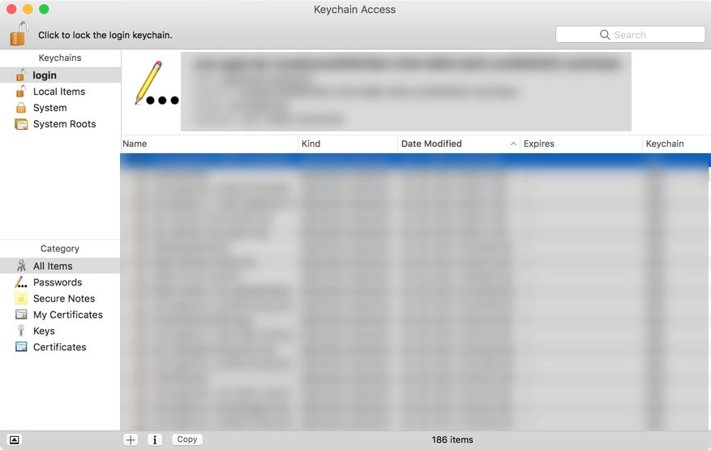

Drag `rootCA.pem` from your vagrant `/www` folder into Keychain Access. You'll now have an entry for `vvv.dev` in your list.

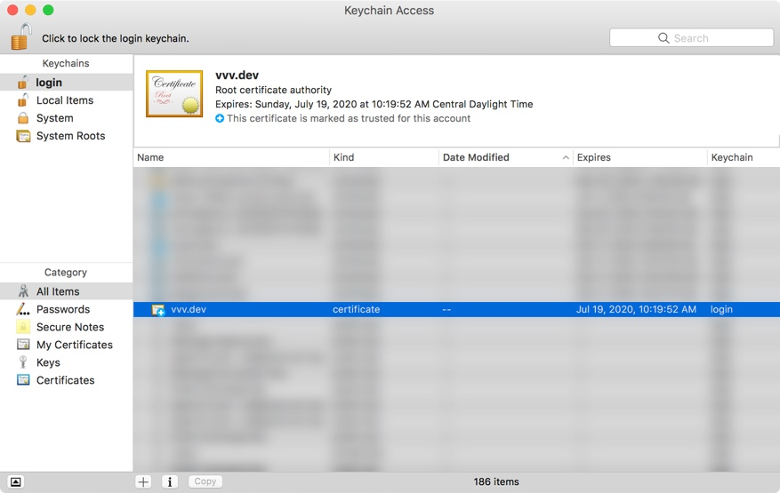

Right click on the listing and select **Get Info**.


Expand the **Trust** dialog. Make sure that **When using this certificate** is set to **Always Trust**.

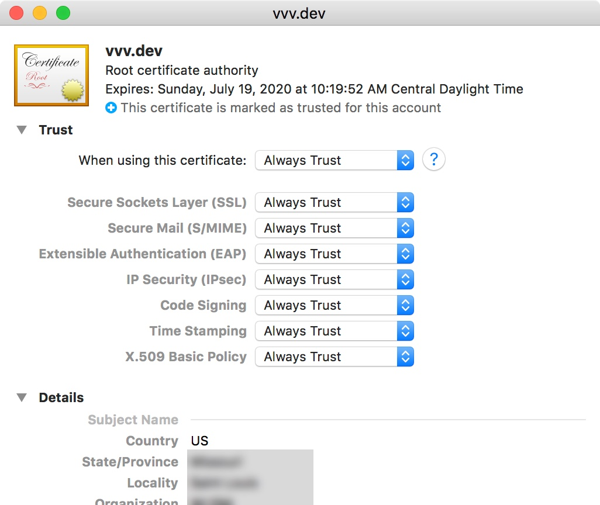

Close out that dialog and Keychain Access. You will probably need to restart your browser for it to take effect.

### Windows
**NOTE**: If you are running Windows 8, 8.1, or 10, go straight to Step 2. If you are running Windows 7, you'll need to use the Management Console and do a few extra steps.

#### **Windows 7 only**
You'll first need to open the Microsoft Management Console. Open the Run dialog (`Win+R`), type `mmc` and then hit enter. Then go to `File -> Add/Remove Snap-in`.

In the **Available snap-ins:** column, click **Certificates** and then click **Add**. It'll appear in the right-hand **Selected snap-ins:** column. Click **OK**.

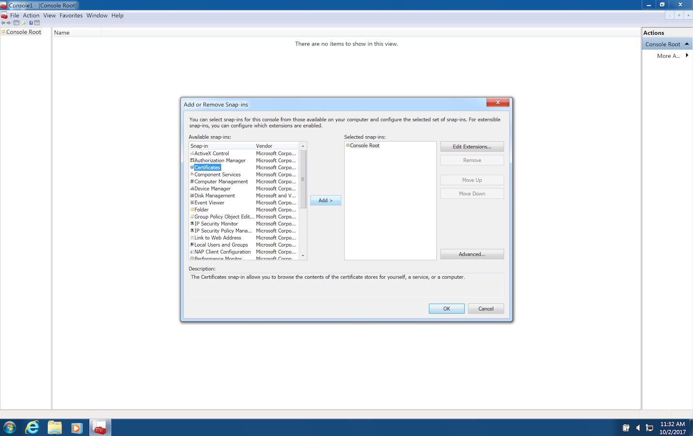

When prompted with **This snap-in will always manage certificates for:**, select **Computer account**. Click **Next**.

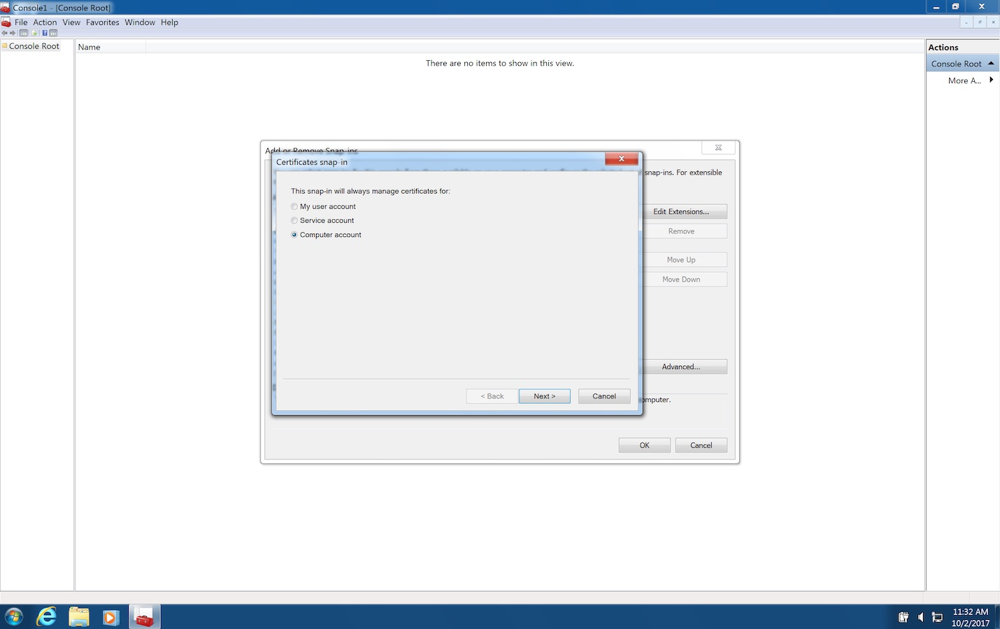

When prompted with **Select the computer you want this snap-in to manage**, select **Local computer** and click **Finish**.

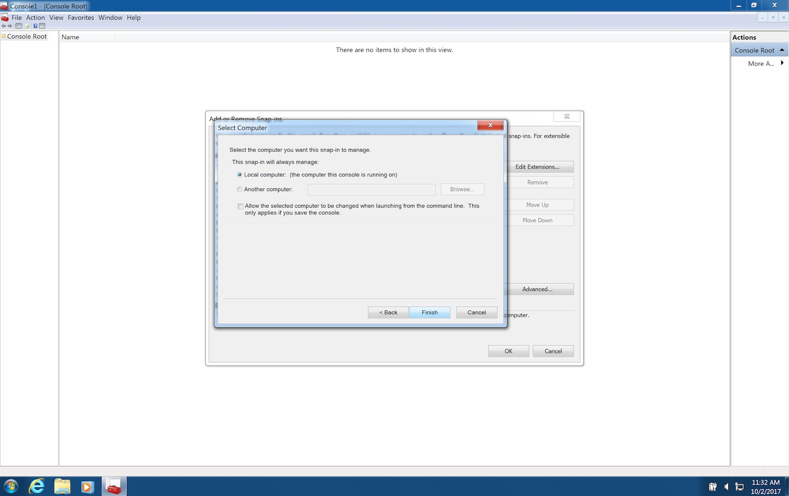

Once finished, **Certificates** will appear in the left column under **Console Root**. Click it and skip down to the **All Windows Versions** instructions.

#### **Windows 8/8.1/10**
Open the Certificate Management Console by opening the Run dialog (`Win+R`), type `certlm.msc` and hit enter.

#### **All Windows Versions**
Expand the **Certificates** dropdown in the left column. Then expand **Trusted Root Certification Authorities** and **Certificates** that's nested under that.

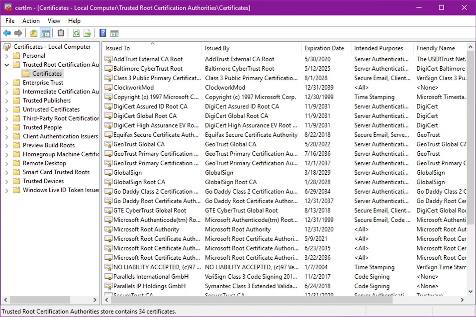

Right click on **Certificates**, and go to `All Tasks -> Import...`.

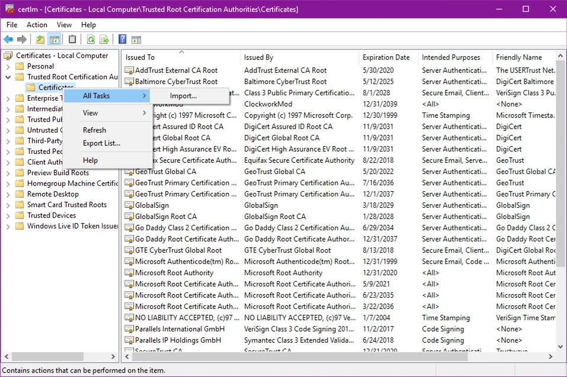

(If you're on Windows 7, this initial dialog box looks slightly different).

Click next.

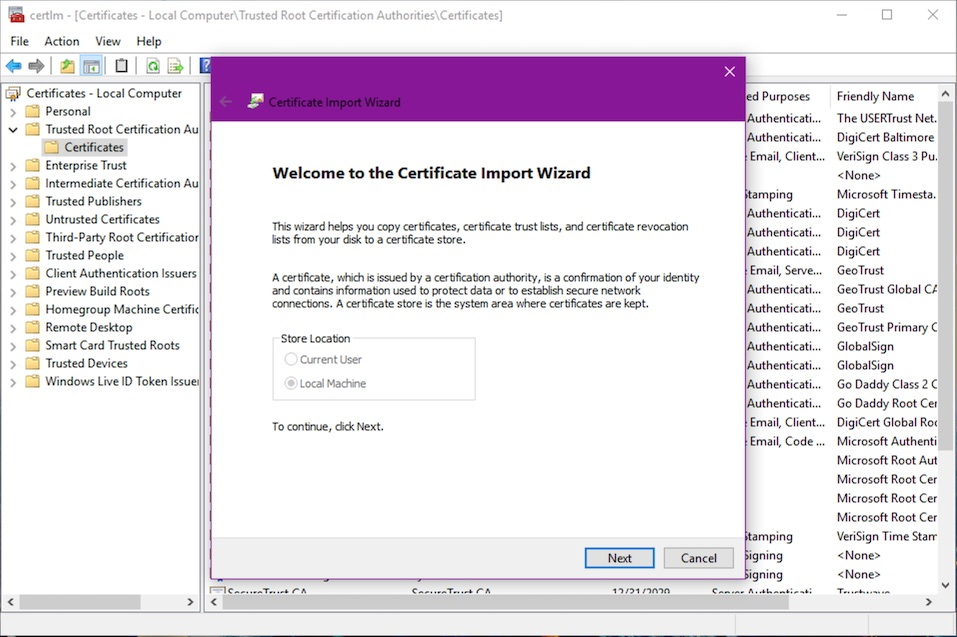

Now you need to navigate to your vagrant install's `/www` folder.

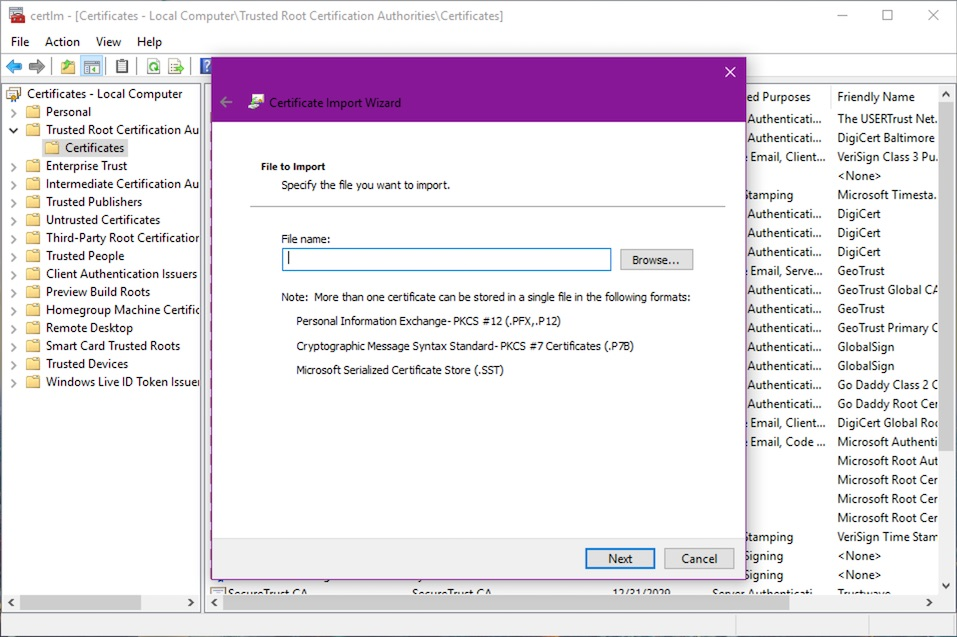

Select `rootCA.pem` and click **Open**. 

(**NOTE**: You may have to change the dropdown to **All files**.)

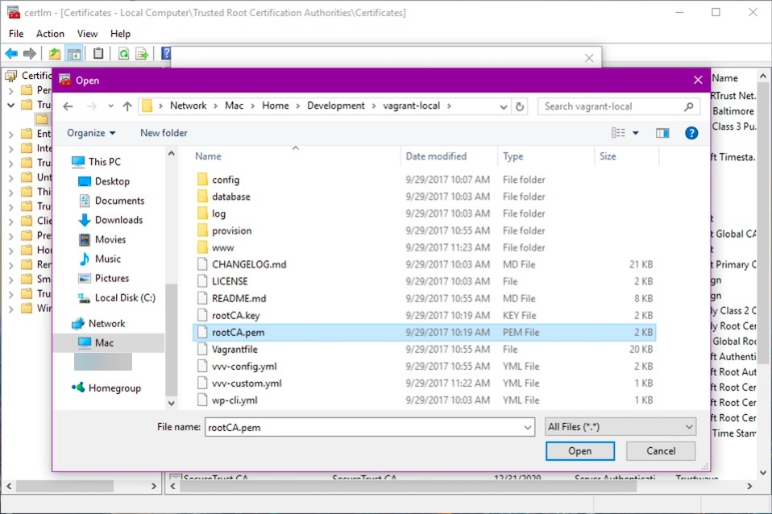

Verify the path to `rootCA.pem` and click **Next**.


Make sure that the certificate will be placed in "**Trusted Root Certification Authorities**". Click **Next**.

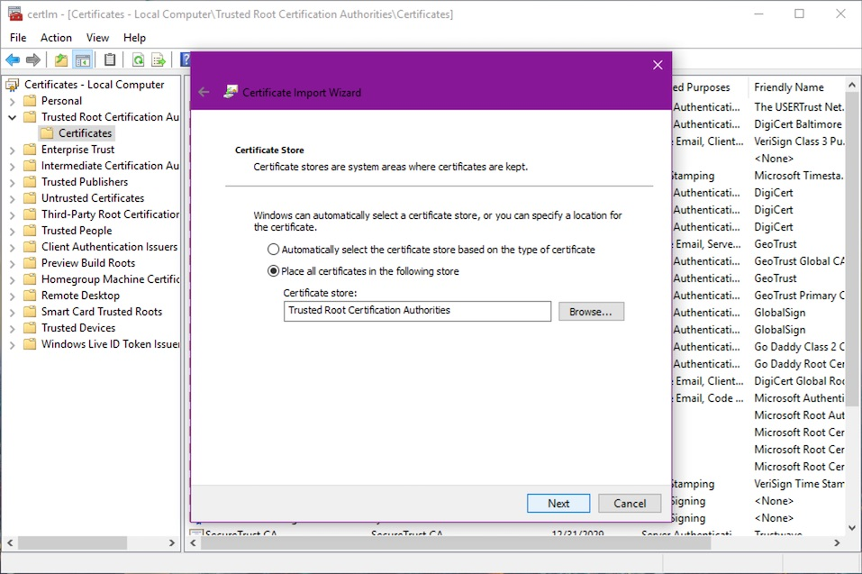

You're done! Verify that an entry issued to `vvv.dev` is in the list.

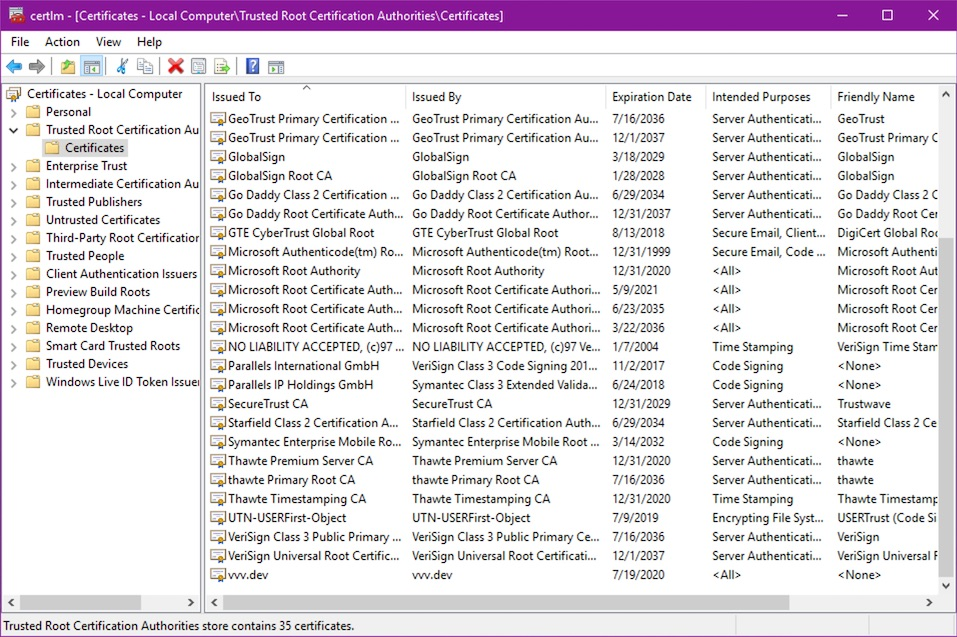

### Linux
Not tested. Perhaps try a solution such as [this one from Superuser](https://superuser.com/posts/719047/revisions)?

## Limitations
~~• Currently does not auto-install/add an admin user to your WordPress install. You'll have to do that yourself. (Possibly coming in a future release)~~
